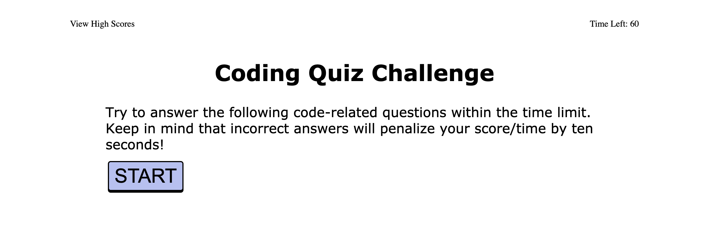

# lauramichellepeterson.github.io-challenge4
https://lauramichellepeterson.github.io/lauramichellepeterson.github.io-challenge4/

# Description
User can take a timed quiz on Java Script fundamentals. If the user get an answer wrong, then seconds are taken from the timer. At the end of quiz the user gets to save their score, and can retake the quiz if desired to improve their score. 

# GitHub
https://github.com/lauramichellepeterson/lauramichellepeterson.github.io-challenge4

